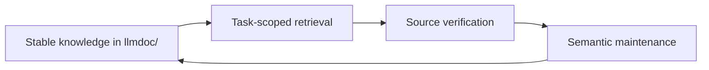

# llmdoc

[简体中文](README.zh-CN.md)

Persistent engineering context that helps coding agents understand a repository
without rediscovering its architecture every session.

- Preserve decisions, constraints, and cross-module contracts that source code
  does not explain cheaply.
- Retrieve only the context a task needs, then verify exact facts against the
  live repository.
- Recheck knowledge semantically as code evolves instead of accumulating stale
  implementation notes.

## Start in 60 seconds

You need Node.js 18 or newer and a Git repository. Choose the path that matches
your repository and agent.

### New repository with Claude Code

Add the marketplace and install the plugin:

```text
/plugin marketplace add TokenRollAI/llmdoc
/plugin install llmdoc@llmdoc-plugin
```

If the install summary says `Run /reload-plugins to activate.`, run that
command. If the reload warns about rereading the conversation, rerun it as
`/reload-plugins --force`. Once the plugin is active, initialize the repository:

```text
/llmdoc:init
```

### New repository with Codex

Add the marketplace and start Codex from the repository:

```bash
codex plugin marketplace add TokenRollAI/llmdoc
codex
```

Inside Codex, run `/plugins`, open the `llmdoc-plugin` marketplace, and install
`llmdoc`. Review the plugin and its hooks before enabling them. Then start a new
Codex session in the repository and ask:

```text
Use the llmdoc:init skill to initialize this repository.
```

### Repository that already has `llmdoc/`

Open its knowledge map immediately—no plugin is required for direct CLI use:

```bash
npx -y @tokenroll/llmdoc tree
npx -y @tokenroll/llmdoc search "revision"
```

`@tokenroll/llmdoc` is external tooling. Do not add it to the consumer project's
`package.json` or lockfile, and never use the unrelated bare package name
`npx llmdoc`. For reproducible runs, pin the package spec:
`npx -y @tokenroll/llmdoc@<version> <command>`. The package exposes the `llmdoc`
bin; the scoped npx form keeps it outside the consumer repository.

## How it works



`llmdoc/` stores durable engineering meaning—not a copy of the repository. An
agent first retrieves the smallest useful knowledge set, uses source and tests
for current facts, and later verifies affected knowledge. A code change creates
a review obligation; it does not automatically create a documentation rewrite.

## Two operating layers

- **Agent workflows** own judgment and safe closeout. Invoke them through the
  host's command or skill interface.
- **Runtime CLI** owns retrieval and deterministic mechanics. Call it with the
  scoped npx command, directly or from a workflow.

The workflows are not four equivalent CLI commands:

- `init` creates a small, high-value V3 knowledge surface when none exists.
- `update` semantically verifies affected knowledge; unchanged documents can be
  recorded as verified without inventing prose changes.
- `prune` reduces duplicate, fragmented, or cheaply reconstructable knowledge;
  the CLI only supplies a read-only report.
- `upgrade` migrates legacy/V2 knowledge. It runs only when the user explicitly
  asks for it and must never be suggested or folded into another workflow.

Every explicit workflow reports exactly one result state: `success`,
`no_change`, `dry_run`, `incomplete`, or `failed`.

## Daily use

Apply this routing gate before broad exploration and again when entering a new
subsystem:

- Concept, contract, term, or “where is X?” → `search <query>`
- Context for concrete source files → `context --files <path...>`
- Cold start or unclear scope → `tree`
- Known topic or kind → `index --topic <topic>` / `index --kind <kind>`
- Bodies already identified → `show <path...>`

These are alternatives, not a fixed sequence. Once llmdoc narrows the working
set, use native tools for exact source text, line numbers, test behavior,
counts, and Git state.

```bash
# Map the knowledge surface
npx -y @tokenroll/llmdoc tree --docs

# Find relevant knowledge
npx -y @tokenroll/llmdoc search "revision" --limit 5
npx -y @tokenroll/llmdoc context --files cli/src/cli.ts

# Read only the selected bodies
npx -y @tokenroll/llmdoc show architecture.mdx cli-runtime/retrieval-and-mutation.mdx

# Browse the knowledge surface locally
npx -y @tokenroll/llmdoc serve
```

Use `npx -y @tokenroll/llmdoc --help` or
`npx -y @tokenroll/llmdoc help <command>` for the complete, current CLI
reference. `status` and `delta` assess validity and impact; they are not
retrieval steps.

## Knowledge and safety boundaries

- Stable knowledge belongs in tracked `llmdoc/`; investigations, caches, and
  reflection candidates belong in local `.llmdoc-tmp/`.
- V3 documents are pure Markdown `.mdx` with YAML front matter and optional
  `<CodeRef>` anchors. The path is the document ID, and `kind` lives in front
  matter rather than directory names.
- The tree contains root singleton documents and one level of topic folders. It
  has no `index.mdx` topic nodes and no nested topic folders.
- `llmdoc/meta.json` is a Git-revision validity ledger, not documentation. Dirty
  worktree state is an additional signal, not a second truth system. Never
  hand-edit the ledger; use the CLI's guarded mutation and commit operations.
- Within agent workflows, `investigator` gathers temporary evidence, `reflector`
  captures privacy-safe lesson candidates, and `recorder` is the only role that
  writes tracked knowledge.
- Every workflow authorizes knowledge maintenance only, not source-code edits.
  Structural writes are validated and confined to the repository's `llmdoc/`
  boundary.
- Hooks emit read-only, fail-open signals through the scoped CLI. Review hooks
  and trust the plugin source before enabling them.
- A `delta` match means “review this claim,” not “rewrite this document.”
  Preserve decisions, rationale, boundaries, invariants, contracts, and
  non-obvious failure semantics; leave reconstructable facts in source, schemas,
  help, tests, or generated configuration.

## Platform integration

### Claude Code

The repository-root Claude plugin is the canonical authored surface. It provides
the operating skill, four explicit workflows, three roles, and lifecycle hooks.
Use the installation flow above, or manage it from Claude Code's plugin UI. See
the [Claude Code plugin documentation](https://code.claude.com/docs/en/discover-plugins)
for current installation behavior.

### Codex

The Codex plugin is generated from the Claude surface and exposes equivalent
skills, roles, and hooks. You can also run `/plugins` in Codex CLI to browse the
Plugins Directory. Start a new session after installation, and inspect
third-party hooks before trusting them. Codex IDE extensions do not currently
support plugins. See the
[official Codex plugin documentation](https://developers.openai.com/codex/plugins)
for current installation behavior.

### Other agents

Agents without a native plugin system can use the same runtime and operating
contract. Copy the portable
[`AGENTS.md` integration recipe](docs/agent-integration.md) into the consumer
repository.

## Develop this repository

The repository root is a private development workspace; the public consumer
artifact is the `@tokenroll/llmdoc` CLI. Claude skills and agents are canonical,
while the Codex surface is generated—do not hand-edit generated packaging.

```bash
npm install
npm run typecheck
npm run lint
npm test
npm run build
npm run validate:dogfood
npm run check:prompts
```

Install from the repository root so the local `llmdoc` bin is linked before
validation. Changes to CLI semantics must remain synchronized with both host
surfaces, the bilingual READMEs, design documentation, and dogfood knowledge.

## Reference

- [Portable Agent integration recipe](docs/agent-integration.md)
- [V3 design notes](docs/v3-design/README.md) (currently marked draft)
- [Operating protocol](skills/llmdoc/SKILL.md)
- Workflow contracts: [`init`](skills/init/SKILL.md),
  [`update`](skills/update/SKILL.md), [`prune`](skills/prune/SKILL.md), and
  [`upgrade`](skills/upgrade/SKILL.md)
- Runtime reference: `npx -y @tokenroll/llmdoc --help`
