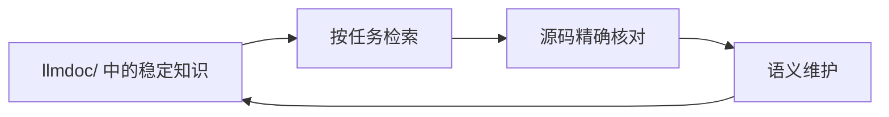

# llmdoc

[官网](https://llmdoc.tokenroll.ai/) · [English](README.md)

持久化工程上下文，让 coding agent 不必在每次会话中重新恢复仓库架构。

- 保存源码难以低成本解释的决策、约束和跨模块契约。
- 只检索当前任务需要的上下文，再回到实时仓库核对精确事实。
- 代码演进后做语义复核，而不是不断堆积过时的实现笔记。

## 60 秒开始

你需要 Node.js 18 或更新版本，以及一个 Git 仓库。请选择与你的仓库和 Agent
匹配的路径。

### 新仓库 + Claude Code

添加 marketplace 并安装插件：

```text
/plugin marketplace add TokenRollAI/llmdoc
/plugin install llmdoc@llmdoc-plugin
```

如果安装摘要提示 `Run /reload-plugins to activate.`，请运行该命令；如果 reload
警告需要重新读取对话，请改用 `/reload-plugins --force`。插件生效后，初始化仓库：

```text
/llmdoc:init
```

### 新仓库 + Codex

添加 marketplace，然后从仓库目录启动 Codex：

```bash
codex plugin marketplace add TokenRollAI/llmdoc
codex
```

在 Codex 中运行 `/plugins`，打开 `llmdoc-plugin` marketplace 并安装
`llmdoc`。启用前先审查插件及其 hooks，然后在仓库中打开新的 Codex 会话并提出：

```text
Use the llmdoc:init skill to initialize this repository.
```

### 已有 `llmdoc/` 的仓库

可以直接打开知识地图——只使用 CLI 不需要先安装插件：

```bash
npx -y @tokenroll/llmdoc tree
npx -y @tokenroll/llmdoc search "revision"
```

`@tokenroll/llmdoc` 是项目外部工具。不要把它加入消费项目的
`package.json` 或 lockfile，也不要使用会解析到无关第三方包的裸命令
`npx llmdoc`。需要可复现运行时，请在包名中固定版本：
`npx -y @tokenroll/llmdoc@<version> <command>`。这个包暴露的 bin 名为
`llmdoc`；使用 scoped npx 形式可以让它留在消费仓库的依赖之外。

## 工作原理



`llmdoc/` 保存的是持久化工程语义，不是仓库副本。Agent 先检索最小且足够的
知识集，再用源码和测试核对当前事实，最后复核受影响的知识。
代码变化会产生复核义务，但不会自动产生文档改写。

## 两层操作面

- **Agent workflows** 负责判断和安全收尾，通过宿主的命令或 skill 接口调用。
- **Runtime CLI** 负责检索和确定性操作，直接或由 workflow 通过 scoped npx
  命令调用。

四条 workflow 不是四个等价的 CLI 命令：

- `init` 在仓库没有 llmdoc 时创建一小组高价值 V3 知识。
- `update` 对受影响知识做语义复核；仍然成立的文档可以标记为已验证，无需制造
  正文改动。
- `prune` 收敛重复、碎片化或可低成本重建的知识；CLI 只提供只读报告。
- `upgrade` 迁移 legacy/V2 知识。它只能在用户显式要求时运行，绝不能被主动
  建议或折入其他 workflow。

每条显式 workflow 只报告一种结果状态：`success`、`no_change`、`dry_run`、
`incomplete` 或 `failed`。

## 日常使用

在广泛探索之前，以及每次进入新子系统时，先应用下面的路由门：

- 概念、契约、术语或“X 在哪里？” → `search <query>`
- 具体源码文件的背景或影响面 → `context --files <path...>`
- 冷启动或范围不明 → `tree`
- 已知 topic 或文档 kind → `index --topic <topic>` / `index --kind <kind>`
- 已经定位的文档正文 → `show <path...>`

这些入口是备选关系，不是固定步骤。llmdoc 圈定工作集后，再使用原生工具核对
源码原文、行号、测试行为、计数和 Git 状态。

`context --files` 会逐个判断输入并报告 `unmappedFiles`；非空的 impacted
结果不会再掩盖同批查询中未映射的其他路径。

插件生命周期 hook 会通过 npm package alias 调用同一个 scoped CLI，避免宿主仓库中
同名但尚未构建 bin 的本地或 `file:` 依赖遮蔽 hook runtime；日常交互命令仍使用上面的短写法。

```bash
# 展开知识地图
npx -y @tokenroll/llmdoc tree --docs

# 查找相关知识
npx -y @tokenroll/llmdoc search "revision" --limit 5
npx -y @tokenroll/llmdoc context --files cli/src/cli.ts

# 只读取已经选中的正文
npx -y @tokenroll/llmdoc show architecture.mdx cli-runtime/retrieval-and-mutation.mdx

# 在本地浏览知识面
npx -y @tokenroll/llmdoc serve
```

完整且最新的 CLI reference 以 `npx -y @tokenroll/llmdoc --help` 和
`npx -y @tokenroll/llmdoc help <command>` 为准。`status` 与 `delta`
用于评估有效性和影响面，不是检索步骤。

### 启动上下文配置

启用 lifecycle hooks 的仓库可以在 llmdoc workspace 根目录增加可选的
`llmdoc.config.json`；在 Git 仓库中，它就是拥有 `llmdoc/` 的最近 Git 根：

```json
{
  "$schema": "https://llmdoc.tokenroll.ai/schemas/config.schema.json",
  "schema": "llmdoc.config/v1",
  "startup": {
    "remindSkill": true,
    "preload": [
      "architecture.mdx",
      "plugin-packaging/claude-and-codex.mdx"
    ]
  }
}
```

- `remindSkill` 控制 SessionStart 是否注入最小操作守则：加载 llmdoc skill、
  经过 CLI retrieval gate，并委派给 llmdoc roles。默认值为 `true`；显式设为
  `false` 才关闭。
- `preload` 按顺序列出精确文档 ID，可以带或不带 `llmdoc/` 前缀。冷启动会按
  声明顺序直接注入完整正文，llmdoc 不设置字符或 token 预算。只有最终完成标记
  可见时才表示宿主提供了完整 preload；若标记缺失，只对缺少的正文执行 `show`。
- compact 重入只列出配置的文档 ID，不会再次注入完整正文；优先延续
  `LLMDOC_STATE`，确有需要时才重新读取。
- `validate` 会报告非法配置、不存在的路径与路径越界；规范化后指向同一文档的
  别名会去重并产生 warning。hook 保持 fail-open：JSON/schema 无法读取时使用
  默认提醒；如果只有 preload 项无效，合法的 `remindSkill` 选择仍会保留。
- `mv` 会事务性重写匹配的 preload 路径；`prune --report` 会列出手工合并或删除
  文档前必须同步的 preload 引用。

没有该文件时，SessionStart 输出状态和默认操作守则，但不预载文档。

CLI 自身的固定界面文案全部使用英文，包括 help、诊断、hook message 与本地
Viewer；中文查询与仓库文档正文仍完整支持，并保持原文返回。

## 知识与安全边界

- 稳定知识属于 tracked `llmdoc/`；调查、缓存和反思候选属于本地 `.llmdoc-tmp/`。
- V3 文档是带 YAML front matter 的纯 Markdown `.mdx`，可以包含可选的 `<CodeRef>`
  锚点。路径就是文档 ID，`kind` 位于 front matter，而不是目录名。
- 文档树由根级单例和一层 topic 文件夹组成；不设 `index.mdx` topic 节点，也不
  允许嵌套 topic。
- `llmdoc/meta.json` 是基于 Git revision 的有效性台账，不是文档。dirty
  worktree 只是附加信号，不是第二套真相系统。不要手工编辑台账；结构变化和
  提交应使用 CLI 的受保护操作。
- 在 Agent workflows 中，`investigator` 收集临时证据，`reflector` 捕获隐私
  安全的经验候选，`recorder` 是唯一写入 tracked knowledge 的角色。
- 每条 workflow 都只授权知识维护，不授权源码编辑。结构写入会经过校验，并被限制在
  仓库的 `llmdoc/` 边界内。
- Hooks 通过 scoped CLI 发出只读、fail-open 的信号。SessionStart 还会注入
  可配置的最小操作守则，因此项目无需在 CLAUDE.md/AGENTS.md 重复该引导。
  启用前先审查 hooks，并确认插件来源可信。
- `delta` 命中表示“复核这条结论”，不是“改写这篇文档”。保留决策及理由、
  边界、不变量、契约和非显然失败语义；可重建事实应留在源码、schema、help、
  测试或生成配置中。

## 平台集成

### Claude Code

仓库根的 Claude 插件是手工维护的 canonical surface，包含 operating skill、
四条显式 workflows、三个角色和 lifecycle hooks。使用上面的安装流程，或通过
Claude Code 插件 UI 管理。安装行为以
[Claude Code 插件文档](https://code.claude.com/docs/en/discover-plugins)为准。

### Codex

Codex 插件由 Claude surface 生成，提供等价的 skills、角色和 hooks。也可以在
Codex CLI 中运行 `/plugins` 浏览 Plugins Directory。安装后请打开新会话，并在
信任第三方 hooks 前先审查它们。Codex IDE extension 当前不支持 plugins。
安装行为以
[OpenAI 官方 Codex 插件文档](https://developers.openai.com/codex/plugins)为准。

### 其他 Agents

没有原生插件系统的 Agent 也可以使用相同的 runtime 和操作契约。把可移植的
[`AGENTS.md` 集成配方](docs/agent-integration.md)复制到消费仓库即可。

## 开发本仓库

仓库根目录是私有开发工作区；面向消费方的公开产物是 `@tokenroll/llmdoc` CLI。
Claude skills 和 agents 是准源，Codex surface 是生成产物——不要手工编辑生成的
打包文件。

```bash
npm install
npm run typecheck
npm run lint
npm test
npm run build
npm run validate:dogfood
npm run check:prompts
```

请从仓库根目录安装依赖，确保本地 `llmdoc` bin 在校验前已建立链接。CLI
语义变化必须与两端宿主 surface、双语 README、设计文档和 dogfood knowledge
保持同步。

## 参考

- [可移植 Agent 集成配方](docs/agent-integration.md)
- [V3 设计说明](docs/v3-design/README.md)（目前标记为 draft）
- [Operating protocol](skills/llmdoc/SKILL.md)
- Workflow contracts：[`init`](skills/init/SKILL.md)、
  [`update`](skills/update/SKILL.md)、[`prune`](skills/prune/SKILL.md) 和
  [`upgrade`](skills/upgrade/SKILL.md)
- Runtime reference：`npx -y @tokenroll/llmdoc --help`
